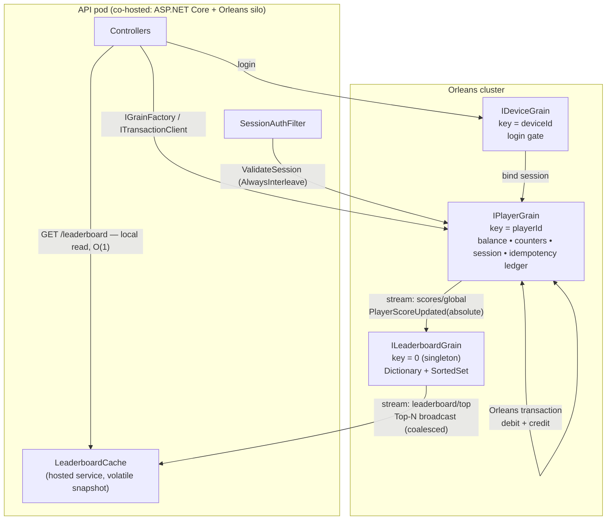

# Player Service — Implementation Plan

> .NET 8 Web API over **Microsoft Orleans** (virtual actors) for a highly concurrent mobile puzzle-game backend.
> Manages sessions, scores, gifting, and a leaderboard. **No database** — Orleans memory providers only.

---

## 1. Mission Summary

### 1.1 Functional requirements

| Endpoint | Purpose |
| --- | --- |
| `POST /login` | Body `{ playerId, deviceId }`. Returns a session token. |
| `GET /players/{playerId}/stats` | Score, gifts sent, gifts received, last-active timestamp. |
| `POST /players/{playerId}/stats/score` | Body `{ points, requestId }`. Adds points. |
| `POST /players/{playerId}/gifts` | Body `{ toPlayerId, points, requestId }`. Transfers points, only if recipient is online. |
| `GET /leaderboard` | Top N players by score. |

Every player starts with **1000 points** on first login. All non-`/login` requests carry the session token.

### 1.2 Non-functional requirements (the actual assignment)

The clients are **unreliable and chatty**: they retry on timeout, send duplicates, deliver requests 30s late, and several update the same player at once. The service is the only source of truth for what a client did. Therefore:

- **Zero lost updates** — concurrent score adds on one player are atomic.
- **Idempotency** — `{playerId, requestId}` for score, `{senderId, requestId}` for gift. Applied exactly once even when two duplicates are in flight *simultaneously*. The idempotency check must itself be atomic.
- **Atomic gifting** — debit+credit is one atomic step; points are conserved; a balance never goes negative; recipient-online is checked atomically with the transfer.
- **No deadlocks** — `p_1→p_2` and `p_2→p_1` in a tight loop must not deadlock.
- **Lock-free / O(1) leaderboard reads** — never sort all players per request; no cache stampede.
- **No global lock** — a single hot player must not serialize the whole service; reads of one player must not queue behind writes to another.
- **Bounded memory** — idempotency records and sessions cannot grow forever.

### 1.3 Constraints & out of scope

- .NET 8 Web API, in-memory only, no DB, no real auth (token = GUID), no UI, no deployment.
- Orleans runs **co-hosted**: every API pod is also a silo (`UseOrleans` on the web host). No separate silo tier, no external client process.
- Clustering/storage/streams use **development providers** (`UseLocalhostClustering`, `AddMemoryGrainStorage`, `AddMemoryStreams`). Production-grade swaps are named per provider in §5.8 but not implemented.
- Target effort ~4–6 hours; a deliberately skipped item is documented, not silently dropped.

---

## 2. Architecture: Orleans Virtual Actors

The service is no longer a single process guarding shared dictionaries with locks. It is a **cluster of silos** where each player is an independently addressable virtual actor. Correctness properties that were previously *implemented* (per-player locks, lock ordering, atomic idempotency) are now *inherited from the runtime*.

### 2.1 Migration summary — what changed and why

| Concern | Was (in-memory, single process) | Now (Orleans) | Why |
| --- | --- | --- | --- |
| Player state | `ConcurrentDictionary<string, PlayerState>` | `IPlayerGrain` per player, `IGrainWithStringKey` | Orleans guarantees **single activation** per key cluster-wide and routes calls by **location transparency**. The dictionary and the "which pod owns this player" question both disappear. |
| Write atomicity | `lock (playerLock)` around read-modify-write | Nothing — grain **turn-based concurrency** | Orleans queues concurrent requests to the same activation and runs them one turn at a time. Business logic stays synchronous and lock-free; race conditions are structurally impossible. |
| Gifting | Double `lock` in `CompareOrdinal` order | **Orleans Transactions** (distributed 2PC) | Sender and recipient may live on different silos, so an in-process double-lock cannot span them. `ITransactionalState` gives all-or-nothing debit+credit with automatic rollback if a participant fails. |
| Deadlock avoidance | Lock ordering by ordinal comparison | Transaction manager: conflicting transactions **abort and retry**; no grain→grain call cycle exists | A total lock order is unnecessary when there is no held lock to order. Contention resolves by abort, not by blocking. |
| Idempotency | `IMemoryCache` + recheck inside the lock | Ledger inside the grain's **transactional state** | The check and the apply are the same turn on the same activation, and for gifts they commit in the same transaction — atomicity is free rather than argued for. |
| Leaderboard writes | `Channel<T>` → single-writer `BackgroundService` per process | Single global `ILeaderboardGrain` fed by an **Orleans Stream** | Each pod calculating its own leaderboard from its own events is wrong across a cluster. One activation is the sole authority for the `SortedSet` and the Top-N recomputation. |
| Leaderboard reads | `volatile List` in the same process | **Push model**: leaderboard grain broadcasts Top-N to a stream; every pod caches it locally | Millions of `GET /leaderboard` calls hitting one grain is the textbook **hot grain** anti-pattern. Pushing inverts it: reads are served O(1) from pod-local memory with **zero network hops**. |
| Sessions | `ConcurrentDictionary<deviceId, SessionInfo>` | `IDeviceGrain` (key = deviceId) + session fields on `IPlayerGrain` | `TryAdd` was the atomic gate for "one session per device"; single activation of the device grain is now that gate, and it works across silos. |

### 2.2 Topology



### 2.3 Grain catalog

| Grain | Key | State | Concurrency |
| --- | --- | --- | --- |
| `IPlayerGrain` | `IGrainWithStringKey` (playerId) | **Transactional:** balance, giftsSent, giftsReceived, idempotency ledger. **Plain:** session token, expiry, lastActive. | `[Reentrant]` (required for transactional participation); session methods `[AlwaysInterleave]`. |
| `IDeviceGrain` | `IGrainWithStringKey` (deviceId) | Current session (playerId, token, expiresAt). | Default non-reentrant — its whole job is to serialize logins. |
| `ILeaderboardGrain` | `IGrainWithIntegerKey` (constant `0`) | `Dictionary<playerId, PlayerScore>` + `SortedSet<PlayerScore>`. Rebuildable; not persisted. | Default non-reentrant single activation = the single writer. |

There is deliberately **no grain per request** and no grain per gift. Gift orchestration is a stateless code path, not an actor.

### 2.4 Why absolute scores on the stream event

The event carries `AbsoluteNewScore`, not a delta. Orleans streams are **at-least-once**, so a redelivered or reordered event must be harmless: an absolute value simply re-states the truth, making the projection **idempotent and self-healing**. A single gift emits **two** entries (sender lower, recipient higher) in one event batch — the projection absorbs paired updates, not just increments.

### 2.5 Pattern-decision summary

| Concern | Decision | Rationale |
| --- | --- | --- |
| Overall | Orleans virtual actors, co-hosted with the API | Many small, independent, interactive entities — the exact shape Orleans is for. |
| Player identity | `IGrainWithStringKey` | Player IDs are opaque strings; no relational key, no GUID requirement. |
| Write atomicity | Turn-based concurrency (no locks) | Single activation + single-threaded turns ⇒ no lost updates by construction. |
| Cross-grain atomicity | Orleans Transactions (`ITransactionalState`) | Debit+credit spans two activations on possibly different silos. |
| Gift deadlock | Transaction started at the API layer; **no grain→grain call chain** | With no cycle in the call graph, activation-level deadlock is impossible; conflicts abort and retry. |
| Idempotency | Ledger inside the sender/player transactional state | Commits atomically with the effect it describes. |
| Leaderboard ingest | Orleans stream → single `ILeaderboardGrain` | Decouples the write path; one authoritative `SortedSet` per cluster. |
| Leaderboard read | Stream broadcast → pod-local `volatile` snapshot | Wait-free O(1) read, zero hops, no stampede — solves the hot-grain read problem. |
| Sessions | `IDeviceGrain` single activation | Atomic "one session per device" across the cluster. |
| Serialization | `[GenerateSerializer]` + `[Id(n)]` + `[Alias]` | Stable wire contracts and version-tolerant rename path. |
| Providers | Memory clustering/storage/streams | "No database" constraint; production swaps named, not implemented. |

> **Note on the previously planned CQRS design:** the `Channel<T>` + `BackgroundService` single-writer projection was correct *for one process* and wrong for a cluster — each pod would have computed its own divergent leaderboard from its own local events. The single-writer principle survives; its implementation moves from "one thread in one process" to "one activation in the cluster," which is the same guarantee with cluster-wide scope.

---

## 3. Solution Structure

Grain interfaces must be referenced by both the silo and (potentially) an external client, so they live in their own assembly. DI is grouped via `Add*` extension methods so `Program.cs` stays thin and the same registrations are reusable in tests.

```
PlayerService.sln
src/
  PlayerService.Abstractions/            # referenced by grains, API, and tests
    Grains/
      IPlayerGrain.cs
      IDeviceGrain.cs
      ILeaderboardGrain.cs
    Models/                              # [GenerateSerializer] records crossing the wire
      PlayerStats.cs
      GiftOutcome.cs
      ScoreOutcome.cs
      PlayerScore.cs
      SessionGrant.cs
    Events/
      PlayerScoreUpdated.cs              # [Immutable] absolute score
      LeaderboardSnapshot.cs             # [Immutable] Top-N broadcast
    Errors/
      GiftRejection.cs                   # enum: Offline, InsufficientFunds, SelfGift, UnknownRecipient
  PlayerService.Grains/
    PlayerGrain.cs                       # [Reentrant] balance, counters, session, idempotency
    DeviceGrain.cs                       # login gate
    LeaderboardGrain.cs                  # stream consumer + SortedSet + Top-N broadcaster
    Internal/
      PlayerBalanceState.cs              # transactional state record
      IdempotencyLedger.cs               # bounded FIFO + TTL prune
      PlayerScoreComparer.cs
  PlayerService.Api/
    Program.cs                           # builder.UseOrleans(...) + AddSessions().AddGifting().AddLeaderboard()
    appsettings.json                     # TTLs, leaderboard N, broadcast interval
    Controllers/
      AuthController.cs                  # POST /login
      PlayersController.cs               # GET stats, POST score, POST gifts
      LeaderboardController.cs           # GET /leaderboard
    Contracts/                           # HTTP DTOs (records) — separate from grain models
      LoginRequest.cs / LoginResponse.cs
      ScoreRequest.cs / GiftRequest.cs / StatsResponse.cs / LeaderboardResponse.cs
    Services/
      GiftService.cs                     # ITransactionClient orchestration + bounded retry
      LeaderboardCache.cs                # IHostedService, stream subscriber, volatile snapshot
    Auth/
      SessionAuthFilter.cs               # token → playerId → IPlayerGrain.ValidateSession
    Extensions/
      OrleansHostExtensions.cs           # UseOrleans configuration (clustering, storage, streams, transactions)
      ServiceCollectionExtensions.cs     # Add* methods
tests/
  PlayerService.Tests/                   # xUnit; InProcessTestCluster + WebApplicationFactory
```

---

## 4. Contracts & Serialization

Every type crossing a grain boundary or a stream is explicitly serialized. `[Id(n)]` numbers are append-only forever; `[Alias]` decouples the wire name from the CLR name so a rename is not a breaking change.

```csharp
[GenerateSerializer, Alias("player-stats")]
public sealed record PlayerStats(
    [property: Id(0)] string PlayerId,
    [property: Id(1)] int Balance,
    [property: Id(2)] int GiftsSent,
    [property: Id(3)] int GiftsReceived,
    [property: Id(4)] DateTimeOffset LastActive);

// Grain-internal transactional state. Balance and counters move together with the gift,
// so they must live in the same transactional record.
[GenerateSerializer, Alias("player-balance-state")]
public sealed class PlayerBalanceState
{
    [Id(0)] public int Balance { get; set; } = 1000;   // seeded on first activation
    [Id(1)] public int GiftsSent { get; set; }
    [Id(2)] public int GiftsReceived { get; set; }
    [Id(3)] public IdempotencyLedger Ledger { get; set; } = new();
}

[GenerateSerializer, Alias("gift-outcome")]
public sealed record GiftOutcome(
    [property: Id(0)] bool Applied,
    [property: Id(1)] GiftRejection? Rejection,
    [property: Id(2)] int SenderBalance,
    [property: Id(3)] int RecipientBalance);

// Stream payloads are immutable — [Immutable] lets Orleans skip the defensive deep copy
// on same-silo delivery.
[GenerateSerializer, Immutable, Alias("player-score-updated")]
public sealed record PlayerScoreUpdated(
    [property: Id(0)] ImmutableArray<PlayerScore> Scores);   // 1 entry for score, 2 for gift

[GenerateSerializer, Immutable, Alias("player-score")]
public sealed record PlayerScore(
    [property: Id(0)] string PlayerId,
    [property: Id(1)] int Score);

[GenerateSerializer, Immutable, Alias("leaderboard-snapshot")]
public sealed record LeaderboardSnapshot(
    [property: Id(0)] ImmutableArray<PlayerScore> Top,
    [property: Id(1)] DateTimeOffset ComputedAt);
```

Grain interfaces are aliased too, and the gift path carries an explicit response timeout so a stuck transaction surfaces as a retryable error rather than a hung request:

```csharp
[Alias("IPlayerGrain")]
public interface IPlayerGrain : IGrainWithStringKey
{
    [Transaction(TransactionOption.CreateOrJoin)]
    Task<ScoreOutcome> AddPointsAsync(int points, string requestId);

    [Transaction(TransactionOption.Join), ResponseTimeout("00:00:05")]
    Task<int> DebitForGiftAsync(string recipientId, int points, string requestId);

    [Transaction(TransactionOption.Join), ResponseTimeout("00:00:05")]
    Task<int> CreditFromGiftAsync(string senderId, int points);

    [ReadOnly] Task<PlayerStats> GetStatsAsync();
    [AlwaysInterleave] Task<bool> ValidateAndSlideSessionAsync(string token);
    [AlwaysInterleave] Task BindSessionAsync(SessionGrant grant);
}
```

---

## 5. Phase 1 — Skeleton & Orleans Wiring (this milestone)

**Goal:** a compiling, runnable cluster whose full topology is in place. `dotnet run` starts a co-hosted silo, the leaderboard grain activates and subscribes to its stream, the pod-local cache subscribes to the broadcast, all endpoints route and return typed stubs, and DI resolves every service. Later phases fill in logic behind these seams without moving them.

### 5.1 Definition of done for Phase 1

- [ ] Solution (Abstractions + Grains + Api + Tests) builds clean (`dotnet build`).
- [ ] `Program.cs` calls `builder.UseOrleans(...)` and composes feature extension methods; no inline registration soup.
- [ ] Silo configured with localhost clustering, memory grain storage (default + `"TransactionStore"`), memory streams, and `UseTransactions()`.
- [ ] All five endpoints route and return a typed placeholder.
- [ ] `IPlayerGrain`, `IDeviceGrain`, `ILeaderboardGrain` exist with full method signatures and stub bodies.
- [ ] `LeaderboardGrain.OnActivateAsync` subscribes to the score stream; `LeaderboardCache` hosted service subscribes to the broadcast stream and primes itself with one direct `GetTopAsync()` pull.
- [ ] Every wire type carries `[GenerateSerializer]` + `[Id(n)]`; the build produces no Orleans serializer analyzer warnings.
- [ ] An `InProcessTestCluster` fixture starts a **2-silo** cluster and resolves a grain — proving the topology is real, not single-process.
- [ ] Contracts and the status-code map (§5.7) are fixed as the public surface.
- [ ] A `README` stub exists with the section headings the final README must fill.

### 5.2 Architecture decision — Player state & lock-free execution

- **One grain per player, keyed by `playerId`.** Orleans guarantees a single activation cluster-wide; `IGrainFactory.GetGrain<IPlayerGrain>(playerId)` resolves it from any pod without the caller knowing where it lives.
- **No locks anywhere in the codebase.** Orleans executes one turn at a time per activation and queues the rest. A read-modify-write on the balance is therefore atomic without any synchronization primitive: `Balance += points` is safe because nothing else can be running on that activation.
- **Zero lost updates** follows directly: concurrent score posts for the same player are serialized by the runtime's per-activation queue, not by a lock we wrote.
- **No global lock** is not a design goal here — it is impossible to express. Activations are independent; a hot player serializes only itself. Reads of player A never touch player B's activation.
- **Grain reentrancy is deliberate, not accidental.** `PlayerGrain` is `[Reentrant]` because transactional grains participate in interleaved 2PC. The invariant that keeps this safe: **any method that mutates plain (non-transactional) fields must complete its read-modify-write within a single turn — no `await` between reading a session field and writing it.** Transactional fields are protected by the transaction's isolation, not by turn boundaries.
- **First-login seeding** of 1000 points happens on first transactional read of a fresh state object (its default `Balance` is 1000) — no explicit "does the player exist" race.

### 5.3 Architecture decision — Idempotency

- **Storage:** an `IdempotencyLedger` living **inside** `PlayerBalanceState`, i.e. inside the transactional state. Keys are namespaced `score:{requestId}` and `gift:{requestId}` — the grain key already scopes them to the player, so `{playerId, requestId}` and `{senderId, requestId}` are naturally distinct namespaces on distinct grains. The stored value is the **exact original outcome DTO**, so a replay returns byte-for-byte what the original returned.
- **Why it is atomic (the whole argument, now trivial):** two simultaneous duplicates target the same grain key. Orleans routes both to the same activation. For score adds, they run in different turns — the second sees the ledger entry the first wrote. For gifts, they run in different transactions against the same transactional state under serializable isolation — the second either observes the committed entry or conflicts, aborts, retries, and then observes it. There is no window in which both can miss and both can apply, and no lock had to be reasoned about to get there.
- **Commit coupling:** the ledger entry is written in the **same transaction** as the debit it describes. If the transaction aborts (recipient offline, insufficient funds, participant failure), the ledger entry rolls back with it — we never cache a success that did not happen. This is the property the old `IMemoryCache` design had to guarantee by hand.
- **Fast path (optimization, not correctness):** a `[ReadOnly]` peek before opening the transaction short-circuits obvious replays without paying 2PC cost. Only the in-transaction check is authoritative.
- **Bounding:** the ledger is a FIFO capped at **256 entries per player** with a **10-minute TTL**, pruned lazily on each write. No per-player timer — millions of grain timers is itself an anti-pattern. Combined with `[CollectionAgeLimit(Minutes = 15)]`, an idle player's activation and its ledger leave memory entirely.
- **Replay after eviction:** once the record is gone (TTL, cap overflow, or a cold activation with memory storage), a late replay is treated as brand-new and may re-apply. Acceptable because the TTL vastly exceeds the client retry window (seconds); documented explicitly.

### 5.4 Architecture decision — Gifting via Orleans Transactions

Sender and recipient can be on different silos, so the previous double-lock is not merely awkward — it cannot work. Gifting is a **distributed two-phase commit**.

**Chosen shape — transaction opened at the API layer, no grain→grain call:**

```csharp
GiftOutcome outcome = default!;
await _transactionClient.RunTransaction(TransactionOption.Create, async () =>
{
    var sender    = _grains.GetGrain<IPlayerGrain>(senderId);
    var recipient = _grains.GetGrain<IPlayerGrain>(toPlayerId);

    // Sender: idempotency check + funds check + debit + ledger write, all inside the transaction.
    var senderBalance = await sender.DebitForGiftAsync(toPlayerId, points, requestId);

    // Recipient: online check + credit, on the recipient's own activation, inside the same transaction.
    var recipientBalance = await recipient.CreditFromGiftAsync(senderId, points);

    outcome = new GiftOutcome(true, null, senderBalance, recipientBalance);
});
```

- **Why the API layer opens it:** the call graph is a tree (`GiftService → sender`, `GiftService → recipient`), never a cycle. `p_1→p_2` and `p_2→p_1` firing simultaneously therefore cannot deadlock at the activation level, because neither player grain ever calls the other.
- **The alternative and why it is rejected:** having `senderGrain.SendGiftAsync` call `recipientGrain.CreditAsync` creates a genuine cycle. On a *non-transactional* grain that is a **classic Orleans deadlock** — the exact failure the assignment tests for — since `[Reentrant]` there is a blanket "allow anything to interleave" escape hatch, not a targeted fix. Tree-shaped orchestration removes the cycle outright instead of papering over it with interleaving.
- **This is a different concern from the `[Reentrant]` in §2.3.** `PlayerGrain` is still marked `[Reentrant]` — that is an Orleans **hard requirement** for any grain using `ITransactionalState`, unconditional on how the transaction is orchestrated: the transaction protocol delivers prepare/commit callbacks into the grain while it is still awaiting other participants, and a non-reentrant grain would deadlock against its own transaction. So `[Reentrant]` here is buying interleaving *with the transaction runtime*, not interleaving between sender and recipient calls — the API-layer tree shape is what removes the latter. Both are true at once: reentrant grains, non-cyclic call graph.
- **Contention, not deadlock:** two transactions touching the same pair in opposite order conflict at the transactional-state layer. Orleans resolves this by **aborting one** (`OrleansTransactionAbortedException`), never by blocking both. `GiftService` retries an aborted transaction up to **3 times with jittered backoff**; the retry is safe precisely because the operation is idempotent — if the first attempt actually committed, the retry finds the ledger entry and returns the original outcome.
- **Never negative:** the funds check and the debit are the same statement inside `PerformUpdate` on the sender's transactional state. Two concurrent 100-point gifts from a 100-point balance cannot both pass, because serializable isolation means the second sees the first's committed effect or aborts.
- **Conservation of points:** debit and credit are one atomic unit. There is no path that commits one without the other; a mid-flight silo failure rolls the whole transaction back.

**Recipient-online guarantee (stated precisely):** liveness is evaluated **on the recipient's own activation, inside the same transaction as the credit**, by reading that grain's own session expiry. If the recipient is offline, `CreditFromGiftAsync` throws and the entire transaction aborts — nothing is debited. The guarantee is: *"if the recipient's session had not expired as of the transaction's commit point, the gift applies; an expiry occurring strictly after commit does not roll it back."* We do not promise the recipient stays online afterwards — only that the check is not stale relative to the write. The session fields are read, never written, inside the gift transaction, so the fact that they are non-transactional state introduces no rollback hazard.

**Score updates use the same machinery** (`TransactionOption.CreateOrJoin`) so balance mutation has exactly one code path. This costs single-participant 2PC overhead on a plain score add — see the trade-off table in §7.3.

### 5.5 Architecture decision — Leaderboard (ingest, computation, and the hot-grain fix)

**Ingest — streams, not direct calls.** After a balance change commits, the player grain publishes `PlayerScoreUpdated` (absolute scores; one entry for a score add, **two** for a gift) to stream `scores/global` on the `"scores"` memory stream provider. Publishing happens *after* the transaction commits, so an aborted transaction produces no event.

**Computation — one activation is the brain.** `LeaderboardGrain` (key `0`) subscribes to that stream in `OnActivateAsync` and is the sole mutator of:

- `Dictionary<string, PlayerScore>` — O(1) lookup of a player's *current* entry so the stale one can be removed.
- `SortedSet<PlayerScore>` with a custom `IComparer` (**score descending, playerId ascending as tie-breaker**) — O(log U) remove+add. Holds **all** players, not just the top N, so a player who gifts points away can fall out of and later climb back into the top N.

Because it is a single non-reentrant activation, it needs **no locks and no concurrent collections** — the same single-writer property the old `BackgroundService` had, now with cluster-wide scope. Orleans delivers stream items in batches, so the drain-and-recompute loop naturally micro-batches: apply every item in the batch, then recompute `Top(N)` once.

**Read path — push, not pull.** `GET /leaderboard` never touches `LeaderboardGrain`. Instead:

1. A grain timer (`RegisterGrainTimer`, activation-local, non-durable — correct here because the leaderboard is a rebuildable projection, not durable business state) fires every **1 s**. If the set changed since the last publish, it broadcasts a `LeaderboardSnapshot` to stream `leaderboard/top`.
2. `LeaderboardCache`, an `IHostedService` on **every** API pod, subscribes to that stream and swaps a `private volatile ImmutableArray<PlayerScore> _snapshot` on each message. A reference assignment is atomic in .NET; `volatile` guarantees visibility.
3. `GET /leaderboard` returns `_snapshot` — **O(1), wait-free, zero network hops, zero grain calls.**

**Why this is the fix, not a mitigation:** the hot-grain anti-pattern is caused by N readers pulling from one activation. Inverting to one publisher pushing to N cached readers makes read throughput independent of the grain entirely. And because the snapshot is *always present and pre-computed*, there is no "expired entry" that triggers recomputation — the **cache-stampede problem is eliminated by construction**. On pod start the cache primes itself with a single direct `GetTopAsync()` call so it is never empty; that is one call per pod lifetime, not per request.

**Staleness guarantee:** eventual consistency bounded by **stream delivery + the 1 s publish interval**, so typically **< 1.1 s**. A score change is visible after the leaderboard grain processes the event and the next broadcast lands. Reads are wait-free. Acceptable because a leaderboard is inherently an approximate, read-mostly view, and the alternative — a consistent read — would reintroduce the hot grain the whole design exists to avoid. The bound is stated in the response body via `ComputedAt` so clients can see the age.

### 5.6 Architecture decision — Sessions

- **`IDeviceGrain` keyed by `deviceId` is the login gate.** Its single activation is the atomic primitive that `ConcurrentDictionary.TryAdd` used to be, except it now holds across the whole cluster. Two identical simultaneous logins are serialized into two turns; the second sees the live session and the API returns **409**.
- **"Online" lives on the player grain.** `IPlayerGrain` holds `Token` and `ExpiresAt`. `IsOnline` is `ExpiresAt > now` evaluated on the recipient's own activation — which is exactly what makes the gift check non-stale (§5.4).
- **Token format:** `{playerId}.{guid}`. The auth filter parses the playerId prefix locally and makes **one** grain call, `ValidateAndSlideSessionAsync(token)`, which validates and slides in a single turn. No separate token-lookup grain, no directory scan.
- **`[AlwaysInterleave]` on session methods:** authentication must not queue behind a slow score transaction on a hot player. These methods touch only the plain session fields, contain no `await`, and complete in one turn — so interleaving is safe. This is the one place reentrancy is load-bearing rather than incidental, and the no-`await` invariant is the thing a reviewer should check.
- **Liveness / expiry policy:** **sliding TTL of 2 minutes.** Any authenticated hit slides the expiry. A crashed device stops sliding and its session expires after 2 min (not locked out forever); a device idle for one minute keeps its session (TTL > 60 s, as required). Expiry is **lazy** — evaluated on read, not swept by a timer — because a timer per player is exactly the anti-pattern §5.3 avoids. Grain collection (`[CollectionAgeLimit]`) reclaims the memory.
- **Same player, second device (documented policy):** **supersede** — a new-device login calls `IPlayerGrain.BindSessionAsync`, which overwrites the token; the prior token stops validating, and the prior `IDeviceGrain` is notified to release. Rationale: preserves the invariant "one online session per player," which keeps the gift online-check a single unambiguous read. (Rejecting with 409 is defensible; supersede is chosen for UX and a cleaner online predicate.)
- **Token rejection:** expired or superseded tokens are rejected **401** by `SessionAuthFilter`, which also performs the slide on success.

### 5.7 Endpoint contracts & status-code map (fixed in Phase 1)

| Endpoint | Success | Client-error statuses | Retry-safe? |
| --- | --- | --- | --- |
| `POST /login` | `200` + token | `400` bad body, `409` device already has active session | No (handle the 409) |
| `GET /players/{id}/stats` | `200` + stats | `401` missing/expired/superseded token, `404` unknown player | Yes (safe/idempotent read) |
| `POST /players/{id}/stats/score` | `200` + current stats | `400` non-positive points, `401`, `404` | **Yes** — same `requestId` returns the same result |
| `POST /players/{id}/gifts` | `200` + result | `400` self-gift / non-positive, `401`, `404` unknown recipient, `409` recipient offline **or** insufficient funds, `503` transaction aborted after retries | **Yes** — same `requestId` returns the original outcome |
| `GET /leaderboard` | `200` + top N + `ComputedAt` | `401` | Yes (wait-free local read) |

Status codes tell the client whether a retry is worth it: `400` = client bug, never retry; `401` = re-auth; `409` = state conflict, retry only after the condition changes; `503` = transient cluster contention, retry with backoff (safe, because the operation is idempotent); a successful/idempotent replay always returns the stored original.

### 5.8 Orleans host configuration

```csharp
// Program.cs (target shape) — API pod IS a silo.
builder.UseOrleans(silo =>
{
    silo.UseLocalhostClustering()               // prod: AddRedisClustering / AddAzureTableClustering
        .AddMemoryGrainStorage("Default")       // prod: AddRedisGrainStorage
        .AddMemoryGrainStorage("TransactionStore")
        .UseTransactions()
        .AddMemoryStreams("scores")             // prod: AddEventHubStreams
        .AddMemoryGrainStorage("PubSubStore")   // required by stream pub-sub
        .Configure<GrainCollectionOptions>(o => o.CollectionAge = TimeSpan.FromMinutes(15));
});

builder.Services
    .AddSessions(builder.Configuration)         // SessionAuthFilter, TTL options
    .AddGifting(builder.Configuration)          // GiftService (ITransactionClient), retry policy
    .AddLeaderboard(builder.Configuration);     // LeaderboardCache hosted service, N, broadcast interval
```

| Registration | Lifetime | Notes |
| --- | --- | --- |
| `IGrainFactory` / `IClusterClient` | Framework (singleton) | Co-hosted; controllers inject directly. |
| `ITransactionClient` | Framework (singleton) | Opens gift transactions from the API layer. |
| `GiftService` | Singleton | Stateless orchestrator + retry policy. |
| `LeaderboardCache` | Singleton + `AddHostedService` | Stream subscriber; holds the `volatile` snapshot. |
| `SessionAuthFilter` | Singleton | One grain call per authenticated request. |
| Controllers | Framework-managed | Inject the above. |

Grains are **not** registered in DI — Orleans activates them; constructor injection of `[TransactionalState]`, `IPersistentState`, `ILogger`, and options works as usual.

---

## 6. Subsequent Phases

Each phase ends with the concurrency test from the assignment's deliverables list, so "done" is demonstrable under real threads **and** across at least two silos.

### Phase 2 — Sessions & Auth
- `DeviceGrain.LoginAsync`: reject if a live session exists, otherwise mint a token and call `IPlayerGrain.BindSessionAsync` (supersede prior device).
- `PlayerGrain.ValidateAndSlideSessionAsync` (`[AlwaysInterleave]`, single turn, no `await`).
- `SessionAuthFilter`: parse playerId from token, one grain call, reject `401`, slide on success.
- **Test:** duplicate `deviceId` login fired in parallel → exactly one `200`, one `409` — run against a **2-silo** cluster so the single-activation guarantee is what is being tested, not a local dictionary.

### Phase 3 — Score updates (atomic + idempotent)
- `PlayerGrain.AddPointsAsync`: `[Transaction(CreateOrJoin)]` → `PerformUpdate`: ledger check → apply → ledger write. Publish `PlayerScoreUpdated` after commit.
- Ledger prune (FIFO cap + TTL) on write.
- **Tests:** N parallel score posts → exact total, nothing lost. Same `requestId` fired 100× in parallel → applied once, 100 identical responses.

### Phase 4 — Gifting (the core)
- `GiftService`: validate (self-gift / non-positive / unknown recipient) → fast-path ledger peek → `RunTransaction` → `DebitForGiftAsync` then `CreditFromGiftAsync` → publish both absolute scores in one event → bounded retry on `OrleansTransactionAbortedException`.
- `DebitForGiftAsync`: ledger check, funds check + debit + `GiftsSent++` + ledger write, all in one `PerformUpdate`.
- `CreditFromGiftAsync`: online check (throws → aborts transaction), credit + `GiftsReceived++`.
- **Tests:** many parallel gifts across random pairs on a 2-silo cluster → total conserved, no negative balance. `p_1↔p_2` tight loop from both sides → no deadlock, all requests terminate. Replayed gift `requestId` after recipient went offline → returns original result, no second transfer. Gift to offline player → `409`, no points moved.

### Phase 5 — Leaderboard grain & push cache
- `LeaderboardGrain`: stream subscription with resumable handles in `OnActivateAsync`, batch apply, `Dictionary` + `SortedSet`, `RegisterGrainTimer` publish-on-change.
- `LeaderboardCache`: subscribe, prime via `GetTopAsync()`, volatile swap.
- **Test:** leaderboard correct after a burst of concurrent scores and gifts, asserted after the documented staleness window; assert both pods converge to the same Top-N.

### Phase 6 — Harness, observability & README
- Concurrency harness covering all deliverable scenarios, on `InProcessTestCluster` with 2 silos + `WebApplicationFactory` for the HTTP-level cases.
- Observability: `System.Diagnostics.Metrics` meter `"Microsoft.Orleans"` wired to the console/OTLP exporter, activity propagation enabled — enough to show grain call latency and transaction abort rate.
- README covering: the Orleans concurrency model and why there are no lost updates or deadlocks; why there is no lock ordering (and what replaced it); idempotency including two simultaneous duplicates and how records stay bounded; the exact recipient-online guarantee; leaderboard structure, complexity and staleness; the push-cache strategy and what invalidates it; session expiry policy; assumptions.

---

## 7. Cross-Cutting Concerns

### 7.1 Points-conservation test (per README requirement)
Snapshot `sum(all balances)` before a burst of random concurrent gifts across a 2-silo cluster; run them; assert the sum is unchanged and that no balance ever went negative. Conservation holds because every gift is a debit+credit inside one distributed transaction — there is no code path that commits half of it, and a silo failure mid-flight rolls both sides back. The test must run **after** draining in-flight retries, since an aborted-and-retried gift is legitimately in flight twice.

### 7.2 Behaviour under load
- **Skewed hot player:** contention is confined to that player's activation. Other players run on other activations, on other silos, in parallel. Reads of one player never queue behind writes to another — different activations, different queues.
- **Hot player + auth:** `[AlwaysInterleave]` session validation does not queue behind that player's in-flight transactions.
- **`GET /leaderboard`:** served from pod-local memory. Throughput scales with pod count and is independent of the leaderboard grain.
- **The one real bottleneck** is `LeaderboardGrain` **ingest** — every score change in the cluster funnels into one activation. Stream batching absorbs a lot, and 1 s coalescing keeps the publish side cheap. If ingest exceeds one activation, shard: M `LeaderboardShardGrain`s keyed by `hash(playerId) % M`, each publishing its local top-N to a merge grain that broadcasts the global Top-N. Documented as the escape hatch, measured before adopting.
- **No global lock exists on any path** — there is no lock on any path.

### 7.3 Trade-offs & what to revisit as it grows
| Decision | Trade-off | Revisit when |
| --- | --- | --- |
| Orleans for a 4–6h assignment | Substantially more machinery than a `ConcurrentDictionary`, but the concurrency guarantees are inherited rather than hand-written and the design survives horizontal scale-out | Never for this brief — but the honest note belongs in the README: for a genuinely single-process service, the in-memory design was cheaper and equally correct. |
| Score adds go through a transaction | Uniform code path and correct if a score add ever races a gift, at the cost of single-participant 2PC latency | If profiling shows score-add latency dominated by transaction overhead, split into a non-transactional fast path guarded by the turn model — only valid because gifts already serialize on the same activation. |
| Transactional idempotency ledger | Commits atomically with its effect, at the cost of growing the transactional state payload | If the 256-entry cap makes state writes expensive, move the ledger to a separate `IPersistentState` and accept a documented "commit-then-record" window. |
| Memory grain storage | No DB, per the constraint; state is lost on silo restart | The day state must survive restart: `AddRedisGrainStorage` / `AddAzureTableGrainStorage` — a config change, no code change, because the grain never sees the provider. |
| Memory streams | Zero infrastructure; events are lost if the leaderboard grain and its pub-sub both die | Swap to `AddEventHubStreams` when the leaderboard must survive a full cluster restart without a rebuild. |
| Single `LeaderboardGrain` | Simple and authoritative vs. one activation for all ingest | Shard by `hash(playerId) % M` + merge grain when measured ingest saturates it. |
| 1 s broadcast interval | Bounded staleness vs. broadcast volume | Tune per product requirement; it is a config value, not a design assumption. |
| Supersede on second device | Clean online predicate vs. silently logs out the other device | If product wants multi-device, move online-ness to per-device and redefine the gift check accordingly. |
| Lazy session expiry | No timers, no sweeper vs. an expired session occupies memory until collection | Fine — `CollectionAgeLimit` bounds it. Revisit only if an accurate live-session count becomes a product requirement. |

### 7.4 Assumptions & open questions
- Player IDs and device IDs are opaque strings; no ordering assumption is needed anywhere, since nothing is lock-ordered.
- "Top N" default `N = 100` (configurable); the leaderboard grain holds all players, roughly 50 bytes each.
- Idempotency TTL 10 min / 256 entries, session TTL 2 min, broadcast 1 s, grain collection 15 min — all configurable defaults, defended above.
- Failed-but-terminal outcomes (offline, insufficient funds) are recorded in the ledger too, so any replay is byte-for-byte stable; a client wanting a genuinely new attempt uses a new `requestId`. Note the subtlety: a *rejected* gift aborts its transaction, so the ledger entry rolls back with it — rejections are therefore recorded in a **separate, non-transactional** grain state write issued after the abort, and this asymmetry is called out in the README.
- Transaction abort under heavy same-pair contention is expected, not exceptional; the retry budget (3, jittered) and the resulting `503` are part of the contract, not a bug.

---

## 8. Phase Overview

| Phase | Deliverable | Demonstrated by |
| --- | --- | --- |
| **1** | Skeleton + Orleans topology wired, grains stubbed | builds, `dotnet run` starts a silo, endpoints route, 2-silo `InProcessTestCluster` resolves grains |
| 2 | Sessions & auth | duplicate-deviceId login rejected across silos |
| 3 | Atomic + idempotent score | N-parallel total exact; 100× dup applied once |
| 4 | Gifting via transactions | conservation, no deadlock, replay-after-offline, offline rejected |
| 5 | Leaderboard grain + push cache | correct after concurrent burst; both pods converge |
| 6 | Harness + observability + README | all scenarios green; README complete |
